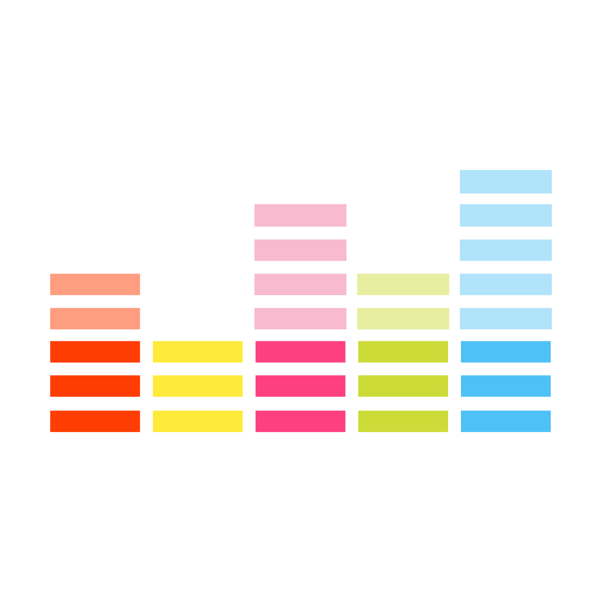

<!--
*** Thanks for checking out this README Template. If you have a suggestion that would
*** make this better, please fork the repo and create a pull request or simply open
*** an issue with the tag "enhancement".
*** Thanks again! Now go create something AMAZING! :D
-->

<!-- PROJECT SHIELDS -->
<!--
*** I'm using markdown "reference style" links for readability.
*** Reference links are enclosed in brackets [ ] instead of parentheses ( ).
*** See the bottom of this document for the declaration of the reference variables
*** for contributors-url, forks-url, etc. This is an optional, concise syntax you may use.
*** https://www.markdownguide.org/basic-syntax/#reference-style-links
-->
<!-- PROJECT LOGO -->
 

  

  <h3 align="center">Deezer Community Client</h3>

  

    A client for Deezer with Discord rich presence
     
     
    <a href="https://github.com/vleeuwenmenno/deezer-unofficial-client/releases">Download</a>
    ·
    <a href="https://github.com/vleeuwenmenno/deezer-unofficial-client/issues">Report Bug</a>
    ·
    <a href="https://github.com/vleeuwenmenno/deezer-unofficial-client/issues">Request Feature</a>
  

<!-- ABOUT THE PROJECT -->
## About The Project

I like sharing what music I listen. So I made this simple client that shares the music I currently play in Deezer. It stops sharing as soon as you pause your music or close the player.
Thanks to Braasileiro for the original version of the client!

<!-- CONTRIBUTING -->
## Contributing

Contributions are what make the open source community such an amazing place to be learn, inspire, and create. Any contributions you make are **greatly appreciated**.

1. Fork the Project
2. Create your Feature Branch (`git checkout -b feature/AmazingFeature`)
3. Commit your Changes (`git commit -m 'Add some AmazingFeature'`)
4. Push to the Branch (`git push origin feature/AmazingFeature`)
5. Open a Pull Request

<!-- LICENSE -->
## License

This project is a fork from https://github.com/Braasileiro/DeezerRPC
It is licensed under the same license as the original: GNU General Public License v3.0
https://github.com/Braasileiro/DeezerRPC/blob/master/LICENSE

<!-- CONTACT -->
## Contact

Menno van Leeuwen - menno@vleeuwen.me - [menno.vleeuwen.me](https://menno.vleeuwen.me)
Project Link: [https://github.com/vleeuwenmenno/deezer-unofficial-client](https://github.com/vleeuwenmenno/deezer-unofficial-client)